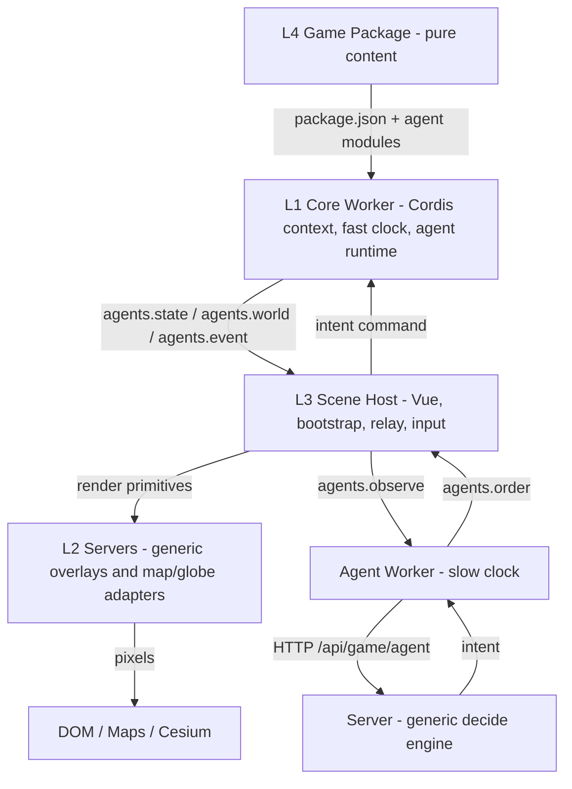
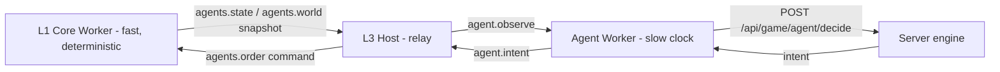

# Web Geospatial Script-Free Multi-Agent Simulation Game Engine

A browser-based engine where autonomous **agents** — not authored scripts — drive an
emergent simulation on a real-world 2D/3D map, and games ship as pure-data **packages**
the engine renders.

---

## Design philosophy

The full-fledged name — **web geospatial script-free multi-agent simulation game
engine** — is a stack of deliberate commitments. Unpacked from the core idea outward:

**Agent (multi-agent).** An agent is a modular container of named **capabilities**, its
own **state**, and one **reasoning** plugin:

- **Sensors** read the world (`scanFire`, `nearbyAgents`, …) — pure queries that return JSON.
- **Actuators** change it (`moveTo`, `dropWater`, `sprayDryIce`, `emitMessage`, …) — every
  intent flows through one funnel: `validate → clamp → gate → apply`.
- **State** is the agent's own memory (pose, status, inventory).
- **Reasoning** decides the next intent, and it is a *swappable plugin* — four built-in
  interpreters behind one interface:

| kind | clock | what it is |
|---|---|---|
| `stateMachine` | fast | a deterministic FSM table (the default for most agents) |
| `rlPolicy` | fast | a deterministic/seeded policy table |
| `remote` | slow | an LLM/VLM call over the slow clock (proposes intents) |
| `human` | slow | a player's input, routed as an order |

A game is a **world of such agents** sensing, deciding and acting on one another and a
shared environment. The design pushes "everything is a plugin" one step further —
**everything can be an agent**: a drone, a hazard cell, an NPC commander or a human
player all run through the same generic runtime.

**Script-free.** There is no pre-authored storyline. A package declares only
**archetypes** (agent templates), a shared **environment** (the world grid + its rules)
and optional triggers; the narrative **emerges** from the agents themselves. What the
agents do to and with one another — cooperation, competition, conflict — **is** the story:
it unfolds naturally from their local decisions instead of being scripted in advance.
Because the fast clock is seeded and deterministic, the same package + seed replays the same
emergence — no separate replay system, no scripted cutscenes. Packages are declarative
toward the engine too: pure data + pure functions, never imperative calls into it.

**Simulation game.** Today it ships as a collaborative **strategy / simulation game** —
the flagship `demo-wildfire` package is a wildfire-defence scenario played on a live map.
But the same machinery (autonomous agents over a real-world spatial model) is exactly
what a **real application** needs: emergency-response planning, fleet rehearsal, or
training. A package is built to graduate from game to serious use without a rewrite.

**Engine.** Engine and games are strictly separate. The engine ships **generic
mechanisms only** and names no domain; a game **package** ships pure content (agents,
environment, render bindings). The contract between them is a single rule:

> **Packages message the engine; only the engine touches the browser.**

Package code never calls a browser API — no DOM, no `window`/`document`, no canvas/WebGL,
no Cesium, no `fetch`, no storage. It computes and emits **plain JSON messages**; the
engine is the one component that turns those messages into pixels and side effects. This
is enforced **structurally**, not by discipline: at play time package code runs inside a
Web Worker where `window` and `document` do not exist, so a violation is a crash on
arrival, not a review finding.

> **Litmus test:** adding or removing an agent edits ONLY `games/<package>/**`. If any
> `client/src/engine/**`, `client/src/workers/**` or `server/app/**` file must change, the
> boundary is wrong.

**Geospatial.** The engine ships a ready-to-go **2D + 3D world**: Google Maps (2D) and a
Cesium globe (3D), with agents placed at real latitude/longitude over real terrain and
imagery. Authors get a convincing sense of the real world for free and spend their effort
on behavior, not on building a map or a renderer.

**Web.** It runs entirely in the browser — nothing to install, instant to share, and easy
to integrate with the web's data and tool resources (map tiles, terrain, LLM/VLM APIs,
live video). Development is fast (Vite hot reload). The core is portable pure ESM
isolated behind a worker + a JSON protocol, so a desktop or console build could reuse it
later if ever needed.

---

## Implementation

### The four-layer architecture



Content flows up as JSON; browser APIs live only at the bottom:

```
package (agents / environment / render — pure data + functions)
   │   { "type": "agents.state" | "agents.world" | "agents.event", ... }   <- JSON only
   ▼
static engine (protocol kernel, agent runtime, effects, overlays, views)
   │   the ONLY holder of browser APIs
   ▼
DOM / WebGL / Google Maps / Cesium
```

#### L1 — Core worker (the fast clock)
`client/src/workers/gameCore.worker.js`

One worker = one game session = one [Cordis](https://github.com/deepseek-ai/cordis) root
`Context` (Cordis is the plugin/context runtime that provides the framework glue). It:
- mounts framework services — `TimerService` (disposal-aware timers) and `ClockService`
  (the deterministic fixed-step clock, `client/src/engine/clock.js`);
- bridges the protocol families onto the Cordis databus;
- fetches the package `package.json`; when it carries an `agents` block, mounts the
  generic **AgentRuntime** and imports the declared agent / environment modules through
  the package loader (`client/src/engine/agents/loadPackage.js`) — the loader is what
  imports the package's sim/scenario modules;
- emits `core.ready`, streams state (`agents.state` / `agents.world` / `agents.event`),
  and reports `game.over`.

There is no `window`/`document` here. The clock advances simulation time in fixed `0.5 s`
steps (seeded, deterministic); speed is wire-controlled by a `setSpeed` command. The core
**never awaits a model**.

#### L2 — Servers (render primitives)
`client/src/effects/agent/*`

Main-thread effect catalog + glue that turns protocol messages into browser API calls.
These are the **only** holders of browser APIs. The primitives are GENERIC — they name no
domain:
- `sceneModel.js` — the render model: batches agent markers / models / polylines and the
  environment cell grid from `agents.state` / `agents.world`;
- `markerOverlay.js` · `modelOverlay.js` · `polylineOverlay.js` — 2D+3D overlays for
  points, glTF models and lines/orders;
- `cellGridOverlay.js` — drapes the environment grid (a fire burn-scar, say) on the
  Google Maps **Plan** view and the shared Cesium **Steer** globe.

A package never ships rendering code; it maps its own state to these primitives through
`render/bindings.js` (archetype → overlay, cell value → colour).

#### L3 — Scene host
`client/src/composables/useAgentScene.js` + the Vue views

The thin main-thread host (enabled by `?agentDemo=1`) that:
1. spawns the core worker (L1) and hands it the package base URL;
2. relays the worker's `agents.state` / `agents.world` / `agents.event` messages into the
   L2 scene model + overlays (colouring cells via the package's `render/bindings.js`);
3. routes player input into `agents.order` commands for any agent whose archetype declares
   a `human` reasoning plugin (exposed as `window.__agentDemo.order`).

Slow-clock agents (`remote` / VLM) run in a separate **agent worker**
(`client/src/workers/gameAgent.worker.js`); because two workers cannot talk directly, the
host relays between it and the core worker.

#### L4 — Game package (pure content)
`games/<package>/`

Dependency-free ESM that runs in the browser **and** in plain Node. A package imports
nothing from the engine and never fetches — the engine resolves every URL through
`package.json` → the declared module paths → relative to the package base. See
[Game package structure](#game-package-structure) below.

### The protocol kernel

`client/src/engine/protocol.js` — the normative message-envelope registry. Every message
that hops between JavaScript realms is a JSON envelope on this registry — concretely the
**L1 core worker ↔ L3 scene host** boundary (the fast clock) and the **L3 scene host ↔
slow-clock agent worker** boundary. A same-thread call (**L3 → L2** render primitives, or
L4 package code the loader runs *inside* L1) keeps the identical envelope shape. No RPC,
no promises across realms, no shared memory.

- **Envelope**: `{ type: '<wireType>', ...payload }` — flat, structured-cloneable. Both
  events and commands are namespaced `'<domain>.<name>'` (`agents.state`, `agents.order`);
  a few bare `<name>` core commands remain as legacy.
- **Families** (`client/src/engine/families/`): `core` (lifecycle + clock), `agents` (the
  multi-agent wire protocol), `agent` (the slow clock). Each is declared with
  `defineFamily({ name, version, events, commands })` and a field-spec mini-language
  (`'number!'` required, `'object?'` optional, or a predicate).
- **Validation** (warn mode): `ok` · `unknown` (not on the registry → **ignore**, so a
  newer package on an older engine degrades instead of breaking) · `invalid` (known type,
  bad payload → console.error loudly, still deliver).
- **Bus mapping**: events map `.` → `/` (`agents.state` ↔ `agents/state`); commands are
  prefixed `cmd/` (`agents.order` → `cmd/agents.order`). `createBusBridge()` mounts a
  family onto a Cordis `Context`; listeners die with the owning fiber.

The `agents` family (`client/src/engine/families/agents.js`) is the multi-agent wire
protocol; every message crossing the worker boundary is domain-agnostic JSON:

- **core → host:** `agents.state` `{t, agents:[{id, archetype, alive, pose, status}]}` ·
  `agents.event` `{t, events:[{kind:'message'|'effect'|'note'}]}` · `agents.world`
  `{t, grid?, cells:[[index,value],…]}` (the environment's cell grid as **opaque** value
  deltas — the engine never interprets a value; the package's `render/bindings.js` maps
  value → colour).
- **host → core:** `agents.order` `{agentId, intent}` — inject an external intent (a
  player's or a model's) into one agent's reasoning proxy; it is applied at the next
  commit through the same capability pipeline as everything else.

### The two-clock model



- **Fast clock** (L1): fixed-step, seeded, deterministic. Owns all simulation state. Each
  beat the agent runtime folds the environment snapshot + every agent's state into batched
  `agents.world` / `agents.state` messages.
- **Slow clock** (`client/src/workers/gameAgent.worker.js`): a separate per-session worker
  that owns **every** remote-AI call. Beat-throttled (`beatMs`), one request in flight,
  observations coalesce to the latest, `AbortController`-guarded, and it **never throws**
  into the host — a slow/unreachable model just drops beats.

The model **never mutates state**. It only proposes an **intent** (an ordinary protocol
command such as `dropWater`), which the host forwards verbatim to the core worker; the
core validates and applies it at its next tick commit.

### The server half

- `server/app/game_agent_api.py` — a tiny FastAPI router mounted under `/api/game/agent`:
  `GET /config`, `POST /decide`, `POST /session/open`, `POST /session/close`,
  `GET /sessions`, `POST /archetype`, `GET /archetypes`.
- `server/app/game_agent_engine.py` — a DOMAIN-AGNOSTIC `decide(...)`. The engine names no
  game: a package registers, per archetype, the whitelist of actions it may emit (as
  JSON-schema "tools"), an optional persona and an optional default mode. `decide` builds
  the prompt from those tools and runs a **mode ladder**:
  - `vlm` — a multimodal one-shot call (when the beat carries a screenshot data URL),
    routed to `game_agent.vlm_model`;
  - `llm` — a stateless one-shot call to the Bailian OpenAI-compatible gateway;
  - `auto` (default) — `vlm (if image) → llm → hold` graceful degradation.

  Every answer is validated against the package whitelist (`_validate_generic`),
  range-checked and clamped, so a hallucinated action can never reach the sim. An
  archetype with no declared actions simply holds.
- `server/scripts/agent_dev_server.py` — a dev-only server on `:8000` that mounts the same
  router without the full `app.main` dependency chain. In dev the Vite `/api` proxy
  forwards `:5173/api/*` to it; in production Caddy forwards `/api/*` → `127.0.0.1:8000`.
  **The client uses the identical origin-relative URL in both** — only the host differs.

#### Session lifecycle

Decide beats are counted against an opaque, **session-keyed** registry so the slow clock
can be observed and garbage-collected server-side.

- On start the agent worker POSTs `/session/open` (adopting the server id); on stop it
  best-effort POSTs `/session/close` (`keepalive`).
- Both are **courtesies**: the server keeps an authoritative idle **garbage collector**
  (`game_agent.session_ttl_s`, default 900 s), so a closed tab or crash that never sends
  close is still reaped.
- `decide` never raises into the HTTP layer: a missing key, an unreachable gateway or an
  unparseable answer all degrade to a safe hold (`intent: null`).

### DSH facilities

The engine **adopts DSH's facility set and refines its unit of composition**: where DSH
says "everything is a **plugin**", this engine says "everything can be an **agent**". An
agent is itself a container of DSH-style plugins — named capability plugins (sensors +
actuators) plus one swappable reasoning plugin — so every facility below is realised with
the **agent** as the primary building block rather than a bare plugin. Where each DSH
facility lives in this engine:

| # | Facility | Implementation |
|---|---|---|
| 1 | Agent registry + manifest | `package.json` → declared agent modules → the generic loader; Cordis `ctx.plugin` / `ctx.inject` |
| 2 | Agent lifecycle hooks | Cordis fibers; disposal-aware `ctx.setTimeout`; `root.fiber.dispose()` on halt |
| 3 | State machine (narrow) | one agent's reasoning FSM (`stateMachine`/`rlPolicy`) + the environment's win/lose latch (`game.over`); Vue router views carry the graphic routes |
| 4 | Event databus | Cordis `ctx.emit`/`ctx.on` bridged by `protocol.js` `createBusBridge()` |
| 5 | Shared context store | Cordis `Context` services (`clock`, `timer`) injected per plugin |
| 6 | Backend bridge + RPC | the agent worker's HTTP bridge to `/api/game/agent/*` |
| 7 | Session garbage collector | server-side session registry + idle sweep (`SESSION_TTL_S`) |
| 8 | Asset registry | `catalog.json` → `package.json` → the agent archetype/capability roster |

**State machines, narrow vs broad.** In the *narrow* sense a state machine is one agent's
internal reasoning mechanism — an authored transition table (`stateMachine`/`rlPolicy`)
mapping what the agent observes to the intent it emits. In the *broad* sense the
multi-agent plot is **not** an authored state machine: nobody writes a global transition
table over every agent × every cell. Because the story is not pre-authored, the mechanism
that best represents it is an **event-driven agent-based model** — many local reactive
automata sensing and acting on one shared environment per tick, coordinating by
**choreography** (each agent reacts to its own observations plus the `agents.event`
databus) instead of a central **orchestration** script. The joint system is still fully
deterministic (a session is a pure function of seed + roster + step count), but its states
*emerge* rather than being enumerated — so the "storyline" is the emergent event log the
fast clock produces and replays by seed, not a scripted FSM.

### File structure

```
web-geospatial-multi-agent-simulation-engine/
├── client/       # Vue 3 + Vite app: engine/, effects/, workers/, composables/, views/
├── server/       # FastAPI: game_agent_api.py, game_agent_engine.py, chat_engine.py
├── games/        # L4 content packages (demo-wildfire, ...)
└── deployment/   # production configs + ops docs (Caddy, Squid, MediaMTX, Synapse)
```

Key engine paths:

```
client/src/engine/protocol.js           # envelope kernel + family registry
client/src/engine/clock.js              # fast-clock Cordis service
client/src/engine/families/             # core.js · agent.js · agents.js (normative)
client/src/engine/agents/               # generic agent runtime + world + reasoning + loader
client/src/workers/gameCore.worker.js   # L1 core worker (fast clock)
client/src/workers/gameAgent.worker.js  # slow-clock agent worker (supervisor)
client/src/effects/agent/               # L2 render primitives (marker/model/polyline/cellGrid)
client/src/composables/useAgentScene.js # L3 generic agent host relay (?agentDemo=1)
```

### Game package structure

```
games/demo-wildfire/
├── card.json            # Plaza storefront ONLY (title, copy, trailer, action)
├── package.json         # the agent-boot manifest the core worker fetches FIRST
├── media/               # trailer / poster art
├── meshes/              # the .glb model library referenced by the render bindings
├── render/bindings.js   # aggregates agents/*/render.js + environment/render.js
├── agents/
│   ├── index.js         #   archetype registry (name → spec factory)
│   ├── roster.js        #   which agents to spawn (ids + positions)
│   └── <role>/          #   one folder per character
│       ├── index.js     #     the archetype (capabilities + reasoning kind)
│       ├── reasoning.js #     its reasoning plugin (machines — e.g. an FSM)
│       ├── render.js    #     archetype → overlay, cell/value → style
│       ├── avatar.svg   #     its portrait (map marker, HUD, chat)
│       └── …            #     machines also carry a body/rig (controller_*.js + *.json)
├── environment/
│   ├── environment.js   #   createEnvironment(opts): the world grid + its rules
│   ├── fire_sim.js      #   the pure-JS cellular-automata hazard sim
│   ├── scenario.js      #   the authored scenario (perimeter, ignitions, wind, loss)
│   ├── render.js        #   environment cell value → colour
│   └── verbs/           #   named sensors + actuators (pure functions)
└── dev/                 # developer harnesses + package README (never shipped)
```

The per-agent folder is deliberately shaped like an **object** — the package borrows the
object-oriented paradigm to keep a character self-contained:

- **Encapsulation** — a `<role>/` folder bundles one character's *member data* (its
  archetype `state`: pose, status, any private objectives or memory) with its *methods*
  (`index.js` the spec/constructor, `reasoning.js` its brain, `render.js` its look).
  Internals stay private: the engine's `Agent` publishes only a public `toSnapshot()`, so
  hidden state never leaks unless the package exposes it.
- **Inheritance** — every archetype is mounted on one engine **superclass**, the generic
  `Agent` (its `sense → reason → act → step` contract); a variant (a dry-ice drone vs a
  water drone) reuses that base by a single parameter rather than duplicating logic.
- **Polymorphism** — the reasoning **interface** (`{ kind, decide(), onIntent?() }`) has
  four interchangeable implementations (`stateMachine`, `rlPolicy`, `remote`, `human`);
  the two slow kinds are the *same* in-core **proxy** under different labels, while the
  environment and `render/bindings.js` are **adapters** presenting package content through
  the engine's generic contracts. The runtime calls `decide()` without knowing which.
- **Abstraction** — each actuator's raw `invoke` is wrapped by a **decorator** pipeline
  (`validate → clamp → gate → apply`): the package authors the effect, the engine
  abstracts its safety. The `createReasoning` factory likewise abstracts a `kind` string
  into a live plugin.

- The **environment** is dependency-free ESM exporting `createEnvironment(opts)` →
  `{ bounds, cellAt, tick, snapshot, capabilities }`. It owns the world grid and its
  rules; hosts only render it.
- **Verbs** (the `environment/verbs/` sensors + actuators) are pure functions. Every
  actuator intent flows through the engine's `validate → clamp → gate → apply` funnel, so
  a package can never mutate the sim unsafely.
- The wildfire **scenario** (`environment/scenario.js`: perimeter, `noFuelPolygons`,
  scheduled `ignitions`, wind `keyframes`, `loss.occupyFrac`) is hidden game state and
  never reaches a player-facing renderer.
- `package.json` declares the entry points (`agents.environment`, `agents.roster`,
  `render`); the generic loader (`engine/agents/loadPackage.js`) imports them **inside the
  worker**, so package code still never touches a browser API. A package with no
  `package.json` (or no `agents` block) simply leaves the runtime inert — degrade, never
  break.

Authoring + headless-testing steps live in
[`games/demo-wildfire/dev/README.md`](games/demo-wildfire/dev/README.md).

---

## Build and run

### Build

```bash
cd client && npm install && npm run build   # Vite bundles both workers (gameCore, gameAgent) → static dist/
```

### Run

```bash
cd client && npm run dev                          # Vite dev server → http://localhost:5173
cd server && python3 scripts/agent_dev_server.py   # :8000, the decide engine (auto ladder: vlm → llm → hold)
```

Play URL:
- `http://localhost:5173/play?agentDemo=1` — the agent paradigm (the generic multi-agent
  runtime + the four L2 agent overlays). Override the package with `&pkg=/games/<name>/`.
- Console handles: `__agentDemo.order(agentId, intent)`, `.state()`, `.speed(x)`, `.stop()`.

### Deployment

Production deployment (Alibaba ECS, Caddy, Tailscale) is documented in
[`deployment/README.md`](deployment/README.md).

### Related documents

- Package authoring & dev harnesses: [`games/demo-wildfire/dev/README.md`](games/demo-wildfire/dev/README.md)
- Client setup & API keys: [`client/README.md`](client/README.md)
- Production deployment (Alibaba ECS, Caddy, Tailscale): [`deployment/README.md`](deployment/README.md)

## License

See [LICENSE](LICENSE) for the full End-User License Agreement.
