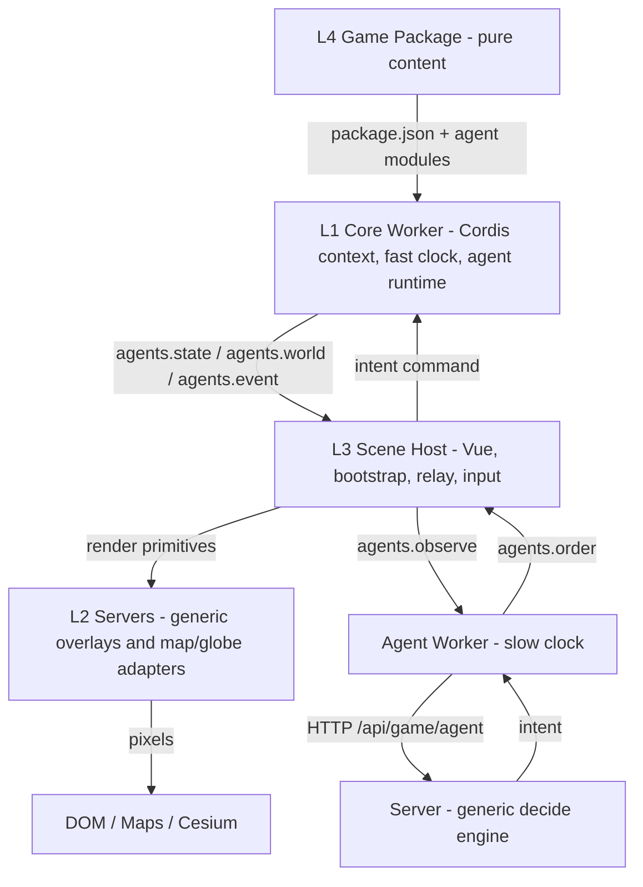
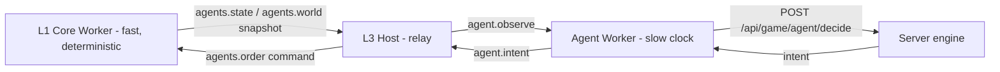

# Web Geospatial Multi-Agent Simulation Engine

A static, content-driven game engine that runs entirely in the browser. Game
**packages** are pure data + pure functions; a small **engine** is the only code
that touches the browser. Simulation runs in a dedicated Web Worker on a
deterministic **fast clock**, while every remote-AI call runs in a separate
**slow-clock** agent worker, so the tick never awaits a model. The framework
glue is [Cordis](https://github.com/deepseek-ai/cordis) (a plugin/context
runtime), and the server-side slow clock is a domain-agnostic **decide engine**
that proposes intents from a package-declared action whitelist (LLM/VLM).

The first shipped package is `demo-wildfire`: a collaborative wildfire-defence
scenario rendered on Google Maps (2D) and Cesium (3D).

---

## The one rule

> **Packages message the engine; only the engine touches the browser.**

Package code (anything under a game package directory) NEVER calls browser APIs — no
DOM, no `window`/`document`, no canvas/WebGL/three.js, no Cesium, no `fetch`, no
storage. A package is pure state plus pure functions: it computes and emits
**textual messages** (plain JSON envelopes). The engine is the single component
that translates those messages into browser API calls.

This is enforced **structurally**, not by discipline: at play time package code
runs inside a Web Worker (L1) where `window` and `document` do not exist, so a
violation is a crash on arrival, not a review finding.

```
package (agents / capabilities / environment / render — pure data + functions)
   │   { "type": "agents.state" | "agents.world" | "agents.event", ... }   <- JSON only
   ▼
static engine (protocol kernel, agent runtime, effects, overlays, views)
   │   the ONLY holder of browser APIs
   ▼
DOM / WebGL / Google Maps / Cesium
```

---

## The four layers



### L1 — Core worker (the fast clock)
`client/src/workers/gameCore.worker.js`

One worker = one game session = one Cordis root `Context`. It:
- mounts framework services — `TimerService` (disposal-aware timers) and
  `ClockService` (the deterministic fixed-step clock, `client/src/engine/clock.js`);
- bridges the protocol families onto the Cordis databus;
- fetches the package `package.json`; when it carries an `agents` block, mounts the
  generic **AgentRuntime** and imports the declared archetype / capability /
  environment modules through the package loader
  (`client/src/engine/agents/loadPackage.js`) — the loader is what imports the
  package's sim/scenario modules;
- emits `core.ready`, streams state (`agents.state` / `agents.world` /
  `agents.event`), and reports `game.over`.

There is no `window`/`document` here. The clock advances simulation time in fixed
`0.5 s` steps (seeded, deterministic); speed is wire-controlled by a `setSpeed`
command. The core **never awaits a model**.

### L2 — Servers (capability adapters)
`client/src/effects/agent/*`

Main-thread effect catalog + glue that turns protocol messages into browser API
calls. These are the **only** holders of browser APIs. The primitives are
GENERIC — they name no domain:
- `sceneModel.js` — the render model: batches agent markers / models / polylines
  and the environment cell grid from `agents.state` / `agents.world`;
- `markerOverlay.js` · `modelOverlay.js` · `polylineOverlay.js` — 2D+3D overlays
  for points, glTF models and lines/orders;
- `cellGridOverlay.js` — drapes the environment grid (a fire burn-scar, say) on
  the Google Maps **Plan** view and the shared Cesium **Steer** globe.

A package never ships rendering code; it maps its own state to these primitives
through `render/bindings.js` (archetype → overlay, cell value → colour).

### L3 — Scene host
`client/src/composables/useAgentScene.js` + the Vue views

The thin main-thread host (enabled by `?agentDemo=1`) that:
1. spawns the core worker (L1) and hands it the package base URL;
2. relays the worker's `agents.state` / `agents.world` / `agents.event` messages
   into the L2 scene model + overlays (colouring cells via the package's
   `render/bindings.js`);
3. routes player input into `agents.order` commands for any agent whose archetype
   declares a `human` reasoning plugin (exposed as `window.__agentDemo.order`).

Slow-clock agents (`remote` / VLM) run in a separate **agent worker**
(`client/src/workers/gameAgent.worker.js`); because two workers cannot talk
directly, the host relays between it and the core worker.

### L4 — Game package (pure content)
`games/<package>/`

Dependency-free ESM that runs in the browser **and** in plain Node. A package
imports nothing from the engine and never fetches — the engine resolves every
URL through `package.json` → the declared module paths → relative to the package
base. See [Package anatomy](#package-anatomy-l4) below.

---

## Everything can be an agent (E6)

E0–E5 shipped a single hazard (`fire`) driven by one engine-side driver plugin.
E6 generalizes that into a **multi-agent framework**: instead of the engine
knowing about "the fire", a game package declares a **world of agents** and the
engine runs them generically. The design extends DSH's "everything is a plugin"
one step further — **everything can be an agent**.

### What an agent is

An agent is a **modular container of named capabilities** plus state plus one
**reasoning plugin**:

- **Sensors** read the world (`scanFire`, `nearbyAgents`, …) — pure queries that
  return JSON.
- **Actuators** change it (`moveTo`, `dropWater`, `sprayDryIce`, `emitMessage`,
  …) — every actuator intent flows through one funnel:
  `validate → clamp → gate → apply`.
- **State** is the agent's own memory (pose, status, inventory).
- **Reasoning** decides the next intent. It is a **plugin**, and the four built-in
  interpreters are interchangeable behind one interface:
  | kind | clock | what it is |
  |---|---|---|
  | `stateMachine` | fast | a deterministic FSM table (the default for most agents) |
  | `rlPolicy` | fast | a deterministic/seeded policy table |
  | `remote` | slow | an LLM/VLM call over the slow clock (proposes intents) |
  | `human` | slow | a player's input, routed as an order |

  The fast reasoners run **inside** the core worker and never await a model. The
  slow ones run through a **proxy**: the deterministic tick uses the last intent
  the slow agent proposed (with an optional fast fallback), and `onIntent()`
  refreshes it whenever the model/player answers — so a slow or unreachable model
  degrades the agent, it never stalls the simulation.

### No pre-authored storyline

A package predefines only **archetypes** (agent templates), an **environment**
(the shared world grid + rules), and optional **triggers**. There is no scripted
sequence of events: the narrative **emerges** from agents sensing, deciding and
acting on each other and the environment. Seeded determinism means the same
package + seed replays the same emergence (without a separate replay system).

### The separation contract (engine ⇄ package)

The engine ships **generic mechanisms only**; the package ships **domain
content**. This is the same "one rule" as before, applied to agents:

- **Engine (generic, names no domain):** the agent runtime, the capability
  registry, the four reasoning interpreters, the world model + spatial index, the
  L2 render primitives, the slow-agent supervisor, and the generic package loader.
  There is **no** `commander`, `staff`, `drone`, `fire` or `tank` identifier in
  engine code.
- **Package (pure content):** archetypes, capabilities, the environment, render
  bindings and the roster. `commander` (a `human`) and `staff` (a `remote`/VLM)
  are **characters of the `demo-wildfire` package** — another game need not have
  them at all.

> **Litmus test:** removing the tank and adding water/dry-ice drones edits ONLY
> `games/<package>/**`. If any `client/src/engine/**`, `client/src/workers/**` or
> `server/app/**` file must change, the boundary is wrong. Renaming
> `demo-wild-fire` → `demo-wildfire` required **zero** engine code changes.

### The generic agent wire protocol

`client/src/engine/families/agents.js` (normative). Everything crossing the
worker boundary is domain-agnostic JSON:

- **core → host:** `agents.state` `{t, agents:[{id, archetype, alive, pose,
  status}]}` · `agents.event` `{t, events:[{kind:'message'|'effect'|'note'}]}` ·
  `agents.world` `{t, grid?, cells:[[index,value],…]}` (the environment's cell
  grid as **opaque** value deltas — the engine never interprets a value; the
  package's `render/bindings.js` maps value → colour).
- **host → core:** `agents.order` `{agentId, intent}` — inject an external intent
  (a player's or a model's) into one agent's reasoning proxy; it is applied at the
  next commit through the same capability pipeline as everything else.

The host relay is `client/src/composables/useAgentScene.js`: it spawns the core
worker, imports the package's `render/bindings.js` for the archetype → style table
and the cell colour mapper, feeds the pure L2 scene model
(`effects/agent/sceneModel.js`), and attaches the four render primitives
(marker / model / polyline / cellGrid, each in 2D + 3D). Enable it with
`?agentDemo=1`.

### Agent package structure (L4)

```
games/demo-wildfire/
├── package.json         # the agent-boot manifest the worker fetches FIRST
├── agents/
│   ├── roster.js        #   which agents to spawn (ids + positions)
│   ├── index.js         #   archetype registry (name -> spec factory)
│   └── <role>/          #   one folder per character: index.js + reasoning.js
│                        #     + render.js + avatar.svg (+ body/rig for machines)
├── environment/         # the shared world grid + rules (+ cellFrame relay)
│   └── verbs/           #   named sensors + actuators (pure functions)
├── render/bindings.js   # aggregates agents/*/render.js + environment/render.js
└── meshes/              # the .glb library referenced by the render bindings
```

`package.json` declares the entry points (`agents.environment`,
`agents.roster`, `render`); the generic loader
(`engine/agents/loadPackage.js`) imports them **inside the worker**, so package
code still never touches a browser API. A package with no `package.json` (or no
`agents` block) simply leaves the runtime inert — degrade, never break.

---

## The protocol kernel

`client/src/engine/protocol.js` — the normative message-envelope registry.
Everything that crosses a realm boundary (core worker ↔ main thread) is a JSON
envelope; same-thread calls keep the identical shape. No RPC, no promises across
realms, no shared memory.

- **Envelope v1**: `{ type: '<wireType>', ...payload }` — flat, structured-cloneable.
  Events are namespaced `'<domain>.<name>'` (`agents.state`); commands are bare
  (`agents.order`).
- **Families** (`client/src/engine/families/`): `core` (lifecycle + clock),
  `agents` (the multi-agent wire protocol), `agent` (the slow clock). Each is
  declared with `defineFamily({ name, version, events, commands })` and a
  field-spec mini-language (`'number!'` required, `'object?'` optional, or a
  predicate).
- **Validation** (warn mode, v1): `ok` · `unknown` (not on the registry →
  **ignore**, so a newer package on an older engine degrades instead of breaking)
  · `invalid` (known type, bad payload → console.error loudly, still deliver).
- **Bus mapping**: events map `.` → `/` (`agents.state` ↔ `agents/state`);
  commands are prefixed `cmd/` (`agents.order` → `cmd/agents.order`).
  `createBusBridge()` mounts a family onto a Cordis `Context`; listeners die with
  the owning fiber.

---

## The two-clock model



- **Fast clock** (L1): fixed-step, seeded, deterministic. Owns all simulation
  state. Each beat the agent runtime folds the environment snapshot + every
  agent's state into batched `agents.world` / `agents.state` messages.
- **Slow clock** (`client/src/workers/gameAgent.worker.js`): a separate per-session
  worker that owns **every** remote-AI call. Beat-throttled (`beatMs`), one
  request in flight, observations coalesce to the latest, `AbortController`-guarded,
  and it **never throws** into the host — a slow/unreachable model just drops beats.

The model **never mutates state**. It only proposes an **intent** (an ordinary
protocol command such as `dropWater`), which the host forwards verbatim to the
core worker; the core validates and applies it at its next tick commit.

---

## The server half (the slow clock's other side)

- `server/app/game_agent_api.py` — a tiny FastAPI router mounted under
  `/api/game/agent`: `GET /config`, `POST /decide`, `POST /session/open`,
  `POST /session/close`, `GET /sessions`, `POST /archetype`, `GET /archetypes`.
- `server/app/game_agent_engine.py` — a DOMAIN-AGNOSTIC `decide(...)`. The engine
  names no game: a package registers, per archetype, the whitelist of actions it
  may emit (as JSON-schema "tools"), an optional persona and an optional default
  mode. `decide` builds the prompt from those tools and runs a **mode ladder**:
  - `vlm` — a multimodal one-shot call (when the beat carries a screenshot data
    URL), routed to `game_agent.vlm_model`;
  - `llm` — a stateless one-shot call to the Bailian OpenAI-compatible gateway;
  - `auto` (default) — `vlm (if image) → llm → hold` graceful degradation.
  Every answer is validated against the package whitelist (`_validate_generic`),
  range-checked and clamped, so a hallucinated action can never reach the sim. An
  archetype with no declared actions simply holds.
- `server/scripts/agent_dev_server.py` — a dev-only server on `:8000` that mounts
  the same router without the full `app.main` dependency chain. In dev the Vite
  `/api` proxy forwards `:5173/api/*` to it; in production Caddy forwards
  `/api/*` → `127.0.0.1:8000`. **The client uses the identical origin-relative
  URL in both** — only the host differs.

### Session lifecycle

Decide beats are counted against an opaque, **session-keyed** registry so the
slow clock can be observed and garbage-collected server-side.

- On start the agent worker POSTs `/session/open` (adopting the server id); on
  stop it best-effort POSTs `/session/close` (`keepalive`).
- Both are **courtesies**: the server keeps an authoritative idle **garbage
  collector** (`game_agent.session_ttl_s`, default 900 s), so a closed tab or
  crash that never sends close is still reaped.
- `decide` never raises into the HTTP layer: a missing key, an unreachable
  gateway or an unparseable answer all degrade to a safe hold (`intent: null`).

---

## DSH facilities → where they live

| # | Facility | Implementation |
|---|---|---|
| 1 | Plugin registry + manifest | `package.json` → declared agent modules → the generic loader; Cordis `ctx.plugin` / `ctx.inject` |
| 2 | Plugin lifecycle hooks | Cordis fibers; disposal-aware `ctx.setTimeout`; `root.fiber.dispose()` on halt |
| 3 | State machine (graphic routes) | agent reasoning FSMs (`stateMachine`/`rlPolicy`) + the environment's win/lose latch (`game.over`); Vue router views |
| 4 | Event databus | Cordis `ctx.emit`/`ctx.on` bridged by `protocol.js` `createBusBridge()` |
| 5 | Shared context store | Cordis `Context` services (`clock`, `timer`) injected per plugin |
| 6 | Backend bridge + RPC | the agent worker's HTTP bridge to `/api/game/agent/*` |
| 7 | Session garbage collector | server-side session registry + idle sweep (`SESSION_TTL_S`) |
| 8 | Asset registry | `catalog.json` → `package.json` → the agent archetype/capability roster |

---

## Package anatomy (L4)

```
games/demo-wildfire/
├── card.json            # Plaza storefront ONLY (title, copy, trailer, action)
├── package.json         # the agent manifest the core worker boots from
├── media/               # trailer / poster
├── agents/              # archetypes/ (templates) + reasoning/ (FSM/RL plugins) + roster
├── capabilities/        # domain sensors + actuators (scanFire, dropWater, sprayDryIce)
├── environment/         # environment.js — adapts the world sim to the generic contract
├── render/              # bindings.js — archetype → overlay, cell value → colour
├── assets/fire/         # the pure-JS fire sim + scenario (imported by environment/)
└── dev/                 # developer harnesses + package README (never shipped)
```

- The **environment** is dependency-free ESM exporting `createEnvironment(opts)`
  → `{ bounds, cellAt, tick, snapshot, capabilities }`. It owns the world grid and
  its rules; hosts only render it.
- **Capabilities** are pure sensors/actuators. Every actuator intent flows through
  the engine's `validate → clamp → gate → apply` funnel, so a package can never
  mutate the sim unsafely.
- The wildfire **scenario** (`assets/fire/controller_fire.js`: perimeter,
  `noFuelPolygons`, scheduled `ignitions`, wind `keyframes`, `loss.occupyFrac`)
  is hidden game state and never reaches a player-facing renderer.

See [Everything can be an agent (E6)](#everything-can-be-an-agent-e6) for the
agent-paradigm structure; authoring + headless-testing steps live in
[`games/demo-wildfire/dev/README.md`](games/demo-wildfire/dev/README.md).

---

## Repository layout

```
web-geospatial-multi-agent-simulation-engine/
├── client/       # Vue 3 + Vite app: engine/, effects/, workers/, composables/, views/
├── server/       # FastAPI: game_agent_api.py, game_agent_engine.py, chat_engine.py
├── games/        # L4 content packages (demo-wildfire, ...)
└── deployment/   # production configs + ops docs (Caddy, Squid, MediaMTX, Synapse)
```

Key engine paths:

```
client/src/engine/protocol.js           # envelope kernel + family registry
client/src/engine/clock.js              # fast-clock Cordis service
client/src/engine/families/             # core.js · agent.js · agents.js (normative)
client/src/engine/agents/               # generic agent runtime + world + reasoning + loader
client/src/workers/gameCore.worker.js   # L1 core worker (fast clock)
client/src/workers/gameAgent.worker.js  # slow-clock agent worker (supervisor)
client/src/effects/agent/               # L2 render primitives (marker/model/polyline/cellGrid)
client/src/composables/useAgentScene.js # L3 generic agent host relay (?agentDemo=1)
```

---

## Workflow

### Run (dev)
```bash
cd client && npm install && npm run dev          # http://localhost:5173
cd server && python3 scripts/agent_dev_server.py # :8000, auto ladder (vlm→llm→hold)
```
Play URL:
- `http://localhost:5173/play?agentDemo=1` — the **agent paradigm** (generic
  multi-agent runtime + the four L2 agent overlays). Override the package with
  `&pkg=/games/<name>/`. Console handles: `__agentDemo.order(agentId, intent)`,
  `.state()`, `.speed(x)`, `.stop()`.

### Build
```bash
cd client && npm run build    # Vite bundles both workers (gameCore, gameAgent)
```

### Test (headless, offline)
Package modules are dependency-free ESM, so Node runs them directly; workers are
tested by stubbing `self` + `fetch`. The engine suite lives as scratch scripts
under `/tmp` and covers: the protocol kernel (E1), the core worker boot/halt
(E2), the generic agent runtime + reasoning plugins, the L2 render primitives, the
world model, the slow-agent supervisor + server `decide` (registry / idle GC /
whitelist validation), and the flagship headless e2e — a real
`gameCore.worker.js` boot that discovers `demo-wildfire`'s agents via
`package.json` and asserts seeded determinism.

Before shipping any package, run the one-rule audit (comments are the only
acceptable hit):
```bash
grep -rn "window\.\|document\.\|fetch(\|THREE\|canvas\|navigator\." \
  games/*/agents games/*/capabilities games/*/environment games/*/render
```

### Deploy
Production deployment (Alibaba ECS, Caddy, Tailscale) is documented in
[`deployment/README.md`](deployment/README.md).

---

## Roadmap (all complete)

| Step | Deliverable |
|---|---|
| **E0** | Cordis-in-Worker browser-compatibility audit (lifecycle/GC proven in a Worker) |
| **E1** | Typed event families + the protocol envelope kernel (`protocol.js`) |
| **E2** | Generic core worker on Cordis; fire re-expressed as a driver plugin |
| **E3** | Slow-clock agent worker + the server decide engine (heuristic / llm) |
| **E4** | DSH counselor bridge: a session-keyed harness with lifecycle + idle GC |
| **E5** | Wildfire port complete: the demo runs fully on E0–E4; transitional E0 audit scaffolding removed |
| **E6** | "Everything can be an agent": generic multi-agent runtime (capabilities + interchangeable reasoning plugins), the agent wire protocol, L2 render primitives, the slow-agent supervisor, and the thin `demo-wildfire` flagship (commander/staff/drone archetypes, no tank) |

---

## Related docs

- Package authoring & dev harnesses: [`games/demo-wildfire/dev/README.md`](games/demo-wildfire/dev/README.md)
- Client setup & API keys: [`client/README.md`](client/README.md)
- Production deployment (Alibaba ECS, Caddy, Tailscale): [`deployment/README.md`](deployment/README.md)

## License

See [LICENSE](LICENSE) for the full End-User License Agreement.
