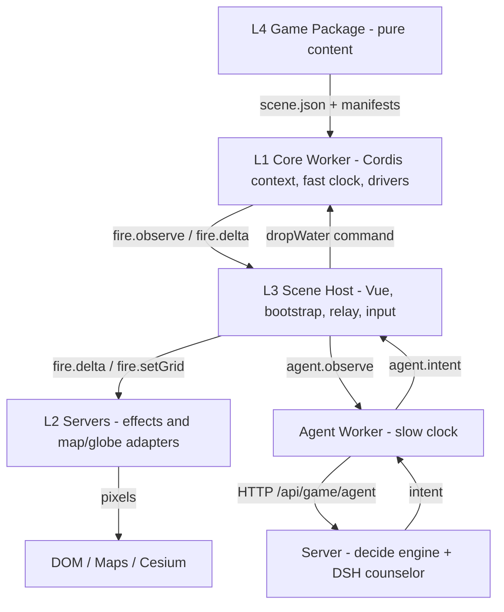
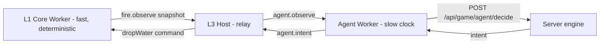

# Web Geospatial Multi-Agent Simulation Engine

A static, content-driven game engine that runs entirely in the browser. Game
**packages** are pure data + pure functions; a small **engine** is the only code
that touches the browser. Simulation runs in a dedicated Web Worker on a
deterministic **fast clock**, while every remote-AI call runs in a separate
**slow-clock** agent worker, so the tick never awaits a model. The framework
glue is [Cordis](https://github.com/deepseek-ai/cordis) (a plugin/context
runtime), and the server-side AI is the DeepSeek-Harness (**DSH**) counselor.

The first shipped package is `demo-wild-fire`: a collaborative wildfire-defence
scenario rendered on Google Maps (2D) and Cesium (3D).

---

## The one rule

> **Packages message the engine; only the engine touches the browser.**

Package code (anything under a game's `assets/`) NEVER calls browser APIs — no
DOM, no `window`/`document`, no canvas/WebGL/three.js, no Cesium, no `fetch`, no
storage. A package is pure state plus pure functions: it computes and emits
**textual messages** (plain JSON envelopes). The engine is the single component
that translates those messages into browser API calls.

This is enforced **structurally**, not by discipline: at play time package code
runs inside a Web Worker (L1) where `window` and `document` do not exist, so a
violation is a crash on arrival, not a review finding.

```
package (sim / controllers / scenario — pure data + functions)
   │   { "type": "fire.delta", "burning": [...], ... }   <- JSON only
   ▼
static engine (protocol kernel, drivers, effects, overlays, views)
   │   the ONLY holder of browser APIs
   ▼
DOM / WebGL / Google Maps / Cesium
```

---

## The four layers



### L1 — Core worker (the fast clock)
`client/src/workers/gameCore.worker.js`

One worker = one game session = one Cordis root `Context`. It:
- mounts framework services — `TimerService` (disposal-aware timers) and
  `ClockService` (the deterministic fixed-step clock, `client/src/engine/clock.js`);
- bridges the protocol families onto the Cordis databus;
- fetches `scene.json`, resolves each asset's manifest, and mounts the asset's
  engine-side **driver** plugin via `ctx.inject(['clock','timer'], driver, config)`
  — the driver is what imports the package's sim/scenario modules;
- emits `core.ready`, streams state (`fire.delta` / `fire.observe`), and reports
  `game.over`.

There is no `window`/`document` here. The clock advances simulation time in fixed
`0.5 s` steps (seeded, deterministic); speed is wire-controlled by a `setSpeed`
command. The core **never awaits a model**.

### L2 — Servers (capability adapters)
`client/src/effects/*`

Main-thread effect catalog + glue that turns protocol messages into browser API
calls. These are the **only** holders of browser APIs:
- `fireEffect.js` — engine-side rasterizer: owns the burn-scar canvas + the live
  burning set; speaks `FIRE_EFFECT_PROTOCOL` (`fire.setGrid` / `fire.delta` /
  `fire.clear`);
- `fireOverlay2d.js` — drapes the effect on the Google Maps **Plan** view;
- `fireOverlay3d.js` — drapes it on the shared Cesium **Steer** globe (clamped
  flame + smoke billboards, LOD-capped, scar rectangle).

A package never ships rendering code; it references engine-owned effects **by
name** (e.g. `engine:fireOverlay2d`).

### L3 — Scene host
`client/src/composables/useFireAgent.js` + the Vue views

The thin main-thread host that:
1. spawns the core worker (L1) and hands it the package base URL;
2. relays the worker's protocol messages into the L2 effect + overlays;
3. routes player input into commands (`dropWater`);
4. surfaces `game.over` as a window event (`fire:gameover`);
5. when the advisor is enabled, spawns the **agent worker** (slow clock) and acts
   as a **dumb relay** between it and the core worker (workers cannot talk
   directly).

### L4 — Game package (pure content)
`games/<package>/`

Dependency-free ESM that runs in the browser **and** in plain Node. A package
imports nothing from the engine and never fetches — the engine resolves every
URL through `scene.json` → manifest → relative path. See
[Package anatomy](#package-anatomy-l4) below.

---

## The protocol kernel

`client/src/engine/protocol.js` — the normative message-envelope registry.
Everything that crosses a realm boundary (core worker ↔ main thread) is a JSON
envelope; same-thread calls keep the identical shape. No RPC, no promises across
realms, no shared memory.

- **Envelope v1**: `{ type: '<wireType>', ...payload }` — flat, structured-cloneable.
  Events are namespaced `'<domain>.<name>'` (`fire.delta`); commands are bare
  (`dropWater`).
- **Families** (`client/src/engine/families/`): `core` (lifecycle + clock),
  `fire` (the hazard), `agent` (the slow clock). Each is declared with
  `defineFamily({ name, version, events, commands })` and a field-spec
  mini-language (`'number!'` required, `'object?'` optional, or a predicate).
- **Validation** (warn mode, v1): `ok` · `unknown` (not on the registry →
  **ignore**, so a newer package on an older engine degrades instead of breaking)
  · `invalid` (known type, bad payload → console.error loudly, still deliver).
- **Bus mapping**: events map `.` → `/` (`fire.delta` ↔ `fire/delta`); commands
  are prefixed `cmd/` (`dropWater` → `cmd/dropWater`). `createBusBridge()` mounts
  a family onto a Cordis `Context`; listeners die with the owning fiber.

---

## The two-clock model



- **Fast clock** (L1): fixed-step, seeded, deterministic. Owns all simulation
  state. Each beat the fire driver folds `fire_sim.hotspot()` + bounds into a
  `fire.observe` snapshot.
- **Slow clock** (`client/src/workers/gameAgent.worker.js`): a separate per-session
  worker that owns **every** remote-AI call. Beat-throttled (`beatMs`), one
  request in flight, observations coalesce to the latest, `AbortController`-guarded,
  and it **never throws** into the host — a slow/unreachable model just drops beats.

The model **never mutates state**. It only proposes an **intent** (an ordinary
protocol command such as `dropWater`), which the host forwards verbatim to the
core worker; the core validates and applies it at its next tick commit.

---

## The server half (the slow clock's other side)

- `server/app/game_agent_api.py` — a tiny FastAPI router mounted under
  `/api/game/agent`: `GET /config`, `POST /decide`, `POST /session/open`,
  `POST /session/close`, `GET /sessions`.
- `server/app/game_agent_engine.py` — `decide_intent(observation, mode, session)`
  with a **mode ladder**:
  - `heuristic` — pure stdlib, deterministic, **offline** (the guaranteed baseline;
    drops on the burning frontier with a wind-lead offset);
  - `llm` — stateless one-shot call to the Bailian OpenAI-compatible gateway;
  - `dsh` — the persistent **counselor** (below);
  - `auto` (default) — `dsh → llm → heuristic` graceful degradation.
  Every answer is whitelist-validated (`ALLOWED_ACTIONS = {dropWater}`),
  range-checked and clamped, so a hallucinated action can never reach the sim.
- `server/scripts/agent_dev_server.py` — a dev-only server on `:8000` that mounts
  the same router without the full `app.main` dependency chain. In dev the Vite
  `/api` proxy forwards `:5173/api/*` to it; in production Caddy forwards
  `/api/*` → `127.0.0.1:8000`. **The client uses the identical origin-relative
  URL in both** — only the host differs.

### The DSH counselor + session lifecycle

The `dsh` policy is a persistent, **session-keyed** `DeepSeekHarness` (the
`deepseek-harness-sdk` child process) that keeps model-side conversation context
across beats — the advisor remembers what it already tried. It is keyed by the
browser agent worker's `session` id (one counselor per session) and reuses
`chat_engine`'s proven Bailian cordis template, but keeps an isolated root at
`server/.dsh_sessions/game/` (gitignored).

- On `agent.start` the worker POSTs `/session/open` (adopting the server id); on
  `agent.stop` it best-effort POSTs `/session/close` (`keepalive`).
- Both are **courtesies**: the server keeps an authoritative idle **garbage
  collector** (`game_agent.session_ttl_s`, default 900 s), so a closed tab or
  crash that never sends close is still reaped.
- The SDK is an **optional** dependency: `GET /config` reports `dshAvailable`, and
  the ladder degrades gracefully when it is absent (localhost) — explicit `dsh`
  returns a safe hold (`intent: null`), never raising into the tick. It is fully
  exercisable on ECS01 where `deepseek-harness-sdk` is installed.

---

## DSH facilities → where they live

| # | Facility | Implementation |
|---|---|---|
| 1 | Plugin registry + manifest | `scene.json` → asset manifest → driver; Cordis `ctx.plugin` / `ctx.inject` |
| 2 | Plugin lifecycle hooks | Cordis fibers; disposal-aware `ctx.setTimeout`; `root.fiber.dispose()` on halt |
| 3 | State machine (graphic routes) | fire sim phases (`spreading`/`extinguished`) + `game.over` outcomes; Vue router views |
| 4 | Event databus | Cordis `ctx.emit`/`ctx.on` bridged by `protocol.js` `createBusBridge()` |
| 5 | Shared context store | Cordis `Context` services (`clock`, `timer`) injected per plugin |
| 6 | Backend bridge + RPC | the agent worker's HTTP bridge to `/api/game/agent/*` |
| 7 | Session garbage collector | server-side session registry + idle sweep (`SESSION_TTL_S`) |
| 8 | Asset registry | `scene.json` assets + manifests + the `DRIVERS` map in the core worker |

---

## Package anatomy (L4)

```
games/demo-wild-fire/
├── card.json            # Plaza storefront ONLY (title, copy, trailer, action)
├── scene.json           # runtime index: asset list + worker entry
├── media/               # trailer / poster
├── assets/<id>/         # ONE directory per asset (dir name = asset id)
│   ├── <id>.json        #   manifest: mesh rig facts + component URLs
│   ├── controller_<id>.js
│   ├── <mesh>.glb
│   └── (fire: fire_sim.js + controller_fire.js scenario)
└── dev/                 # developer harnesses + package README (never shipped)
```

- The **controller** is dependency-free ESM exporting `create<Id>Controller(...)`
  with rate commands, `update(dt)`, `getState()`, `describe()`. It integrates its
  own pose; hosts only render it.
- The **manifest** carries rig conventions as data (`units`, `noseAxis`,
  `yawTrimDeg`, `groundLiftM`) so hosts never re-derive them.
- **Fire-style hazards** point at a sim factory (`createFireSim`) and a generated
  scenario (`createFireScenario`: perimeter, `noFuelPolygons`, scheduled
  `ignitions`, wind `keyframes`, `loss.occupyFrac`). The disaster perimeter is
  hidden game state and never reaches a player-facing renderer.

Authoring + headless-testing steps live in
[`games/demo-wild-fire/dev/README.md`](games/demo-wild-fire/dev/README.md).

---

## Repository layout

```
web-geospatial-multi-agent-simulation-engine/
├── client/       # Vue 3 + Vite app: engine/, effects/, workers/, composables/, views/
├── server/       # FastAPI: game_agent_api.py, game_agent_engine.py, chat_engine.py
├── games/        # L4 content packages (demo-wild-fire, ...)
└── deployment/   # production configs + ops docs (Caddy, Squid, MediaMTX, Synapse)
```

Key engine paths:

```
client/src/engine/protocol.js          # envelope kernel + family registry
client/src/engine/clock.js             # fast-clock Cordis service
client/src/engine/families/            # core.js · fire.js · agent.js (normative)
client/src/engine/drivers/fire.js      # engine-side fire driver (imports the package sim)
client/src/workers/gameCore.worker.js  # L1 core worker (fast clock)
client/src/workers/gameAgent.worker.js # slow-clock agent worker
client/src/effects/                    # L2 adapters (fireEffect, fireOverlay2d/3d)
client/src/composables/useFireAgent.js # L3 scene host
```

---

## Workflow

### Run (dev)
```bash
cd client && npm install && npm run dev          # http://localhost:5173
cd server && python3 scripts/agent_dev_server.py # :8000, heuristic (offline)
```
Play URLs:
- `http://localhost:5173/play?fireDemo=1` — the in-engine fire check (L1 + L2 + L3).
- `http://localhost:5173/play?fireDemo=1&aiAdvisor=1` — add the slow-clock advisor.
  Overrides: `&agentPolicy=heuristic|llm|dsh|auto`, `&agentBeatMs=2500`,
  `&session=<id>`, `&agentApi=http://localhost:8000` (bypass the proxy).
  Console handles: `__fireDemo.drop(lon,lat[,r])`, `.advisor(bool)`,
  `.policy('dsh')`, `.state()`, `.speed(x)`, `.stop()`.

### Build
```bash
cd client && npm run build    # Vite bundles both workers (gameCore, gameAgent)
```

### Test (headless, offline)
Package modules are dependency-free ESM, so Node runs them directly; workers are
tested by stubbing `self` + `fetch`. The engine suite lives as scratch scripts
under `/tmp` and covers: the protocol kernel (E1), the core worker boot/halt
(E2), the fire sim contract, the agent worker slow clock (E3/T17), the
`fire.observe` snapshot, and the DSH counselor bridge — server registry / idle GC
/ cordis render / fallback (`e4_server_test.py`) and the worker session lifecycle
(`e4_session_lifecycle.mjs`).

Before shipping any package, run the one-rule audit (comments are the only
acceptable hit):
```bash
grep -n "window\.\|document\.\|fetch(\|THREE\|canvas\|navigator\." games/*/assets/*/*.js
```

### Deploy
Production deployment (Alibaba ECS, Caddy, Tailscale) is documented in
[`deployment/README.md`](deployment/README.md).

---

## Roadmap (all complete)

| Step | Deliverable |
|---|---|
| **E0** | Cordis-in-Worker browser-compatibility audit (lifecycle/GC proven in a Worker) |
| **E1** | Typed event families + the protocol envelope kernel (`protocol.js`) |
| **E2** | Generic core worker on Cordis; fire re-expressed as a driver plugin |
| **E3** | Slow-clock agent worker + the server decide engine (heuristic / llm) |
| **E4** | DSH counselor bridge: a session-keyed harness with lifecycle + idle GC |

---

## Related docs

- Package authoring & dev harnesses: [`games/demo-wild-fire/dev/README.md`](games/demo-wild-fire/dev/README.md)
- Client setup & API keys: [`client/README.md`](client/README.md)
- Production deployment (Alibaba ECS, Caddy, Tailscale): [`deployment/README.md`](deployment/README.md)

## License

See [LICENSE](LICENSE) for the full End-User License Agreement.
